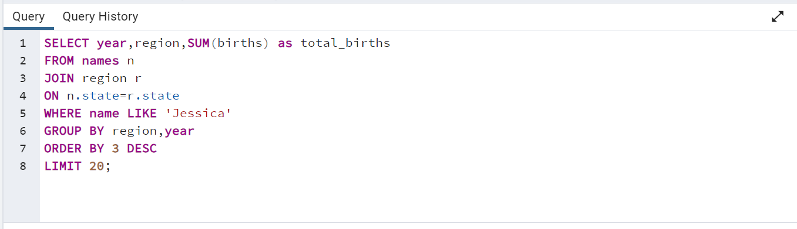
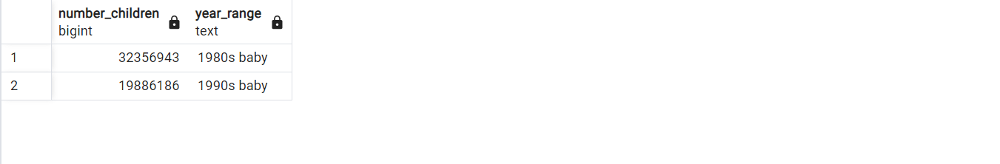

# 
 Babyname Analysis

---

# 
 Overview
Dataset: https://mavenanalytics.io/data-playground?search=baby

Datasource: Maven Plyaground

DataStructure: The dataset has two tables(region and names)

# 
 Questions and Answers
## 1. What is the total number of births by region?
## Query

---

## Output

---

## 2. What is the most common male name?
## Query

---

## Output

---

## 3. What is the most common female name?
## Query

---

## Output

---

## 4. How is the most common male name distributed across region? And distributed yearly?
## Query

---

## Output

---

## 5.  How is the most common female name distributed across region? And distributed yearly?
## Query

---

## Output

---

## 6. What is the total birth via year range?
## Query

---

## Output

---

# 
 Insights
1. The South region has the highest number of births, coming in second place is the Midwest.
   
2. Michael is the most common name for the boy child.Further analysis shows that the name Michael has been consistent over the years and it has high number of children been named Michael. The south region has the highest number of children with the name Michael for 10 years, then midwest number took over the southregion.
   
3. Jessica is the most common names for girl child.Further analysis shows that the name Jessica has been consistent over the years and it has high number of children been named Jessica. The south region has the highest number of children with the name Jessica for 9 years, then midwest number took over the south region.

4. The number of children born in the 1980s were over 32 million, while number of children born in 1990s were over 19 million.

   

---
